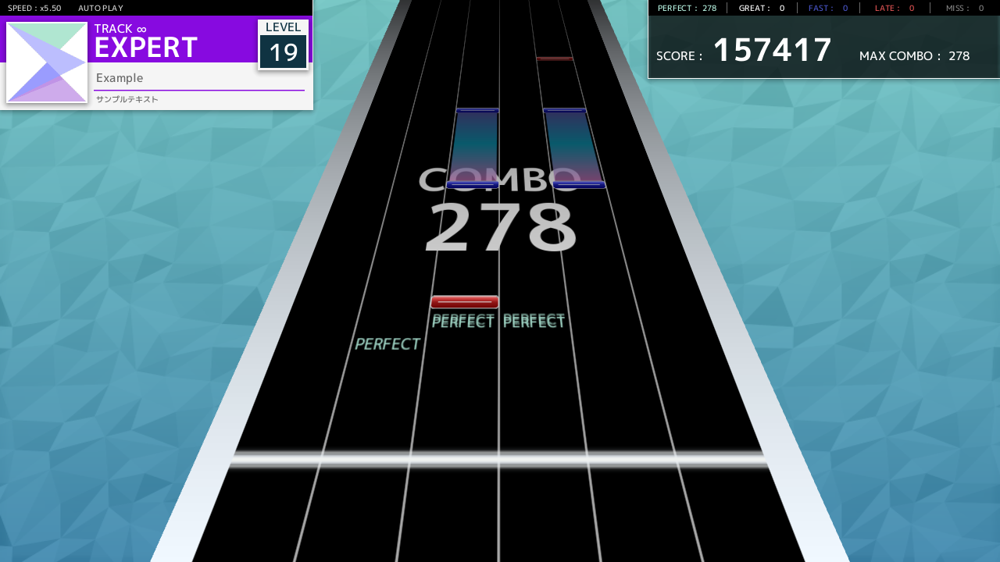

<h1>Sigmabeat2

</h1>

**Sigmabeat2** is a rhythm game made with [OpenSiv3D](https://github.com/Siv3D/OpenSiv3D)

## Screenshot

[Watch the video on YouTube](https://youtu.be/3_WWAGTadlg)

## Build

### Requirements

It requires **Siv3D v0.6.4** for Windows. You can download it from [here](https://siv3d.github.io/download/windows/)

System requirements

|    |   |
| ---- | ---- |
|  OS  | Windows 10 (64-bit) / Windows 11 |
| CPU	 |Intel / AMD CPU |
| Output Devices | Monitors and speakers |
| IDE  |  Microsoft Visual C++ 2022 17.2   (Install "Desktop development with C++" from the Visual Studio Installer) |
